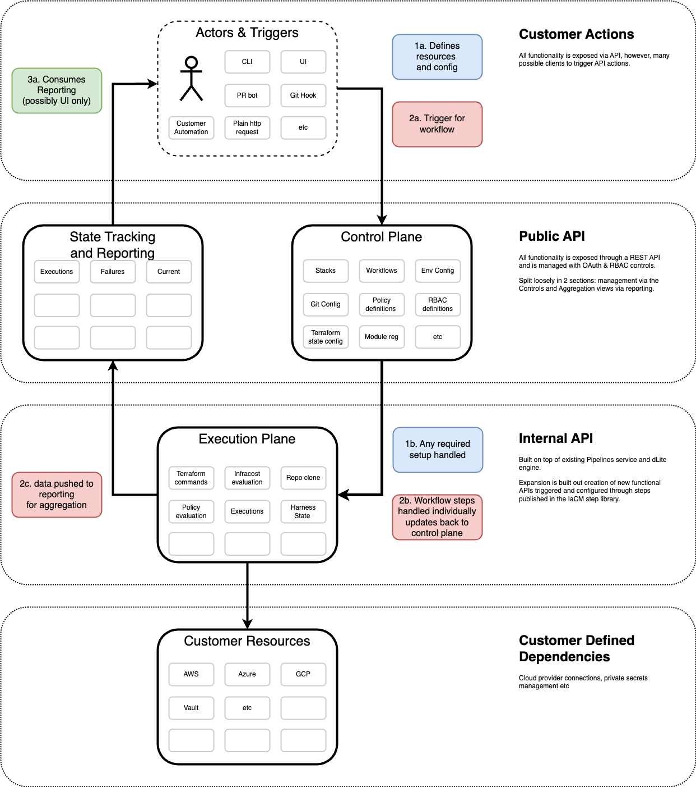
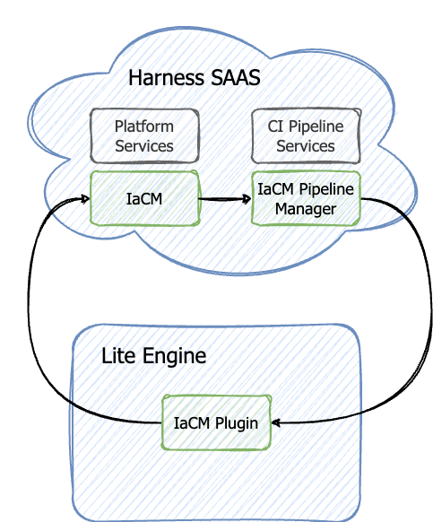

Infrastructure as Code (IaC) is the ability to define resources as code definitions. It allows for repeatable infrastructure configuration. Examples of IaC tools are HashiCorp Terraform and OpenTofu.

Harness Infrastructure as Code Management (IaCM) builds upon traditional IaC practices to address common industry challenges, including:

- **Automating Manual Processes:** By automating the provisioning and updates of infrastructure, IaCM reduces the manual efforts that often delay development cycles.
- **Enhancing Governance:** IaCM centralizes policy management to enforce security best practices and compliance across all infrastructure automatically. This helps minimize security risks and maintains consistency.
- **Increasing Visibility:** It provides centralized insights into the infrastructure’s state, health, usage, and costs, improving operational monitoring and decision-making.
- **Simplifying Rollbacks:** IaCM supports quick, automated rollbacks to stable states, reducing downtime and errors associated with manual processes.
- **Supporting Scalability and Collaboration:** As infrastructure demands grow, IaCM offers tools that facilitate effective collaboration and management across teams, while ensuring compliance with corporate standards.
- **Facilitating Team Collaboration:** IaCM ensures that multiple users and teams can effectively collaborate on shared resources, preventing conflicts and promoting efficient resource changes.

Through these capabilities, Harness IaCM enhances the efficiency, security, and reliability of infrastructure management, catering to the needs of dynamic and growing organizations.

## IaC Infrastructure

### Services and terminology

The IaCM systeme is designed to be extensible with functionality being built through the combination of configuration and task executors handles by the following elements:
1. **Control Plane:** handles resource definition and functionality config management.
Management of Infrastructure as Code tooling has three core resources to work with:
  - Resource Stacks: the infrastructure under control of a IaC tool
  - Templates: the IaC files

To each of these functionality can be added through Workflows. The Control Plane manages the configuration of these resources along with workflow definitions and config required for managing. 
It is a collection of RESTful APIs, UI controls, Task Executors and possible background processes. Functionality is added through the combination of these. 

2. **Execution Layer:** based on definitions handles the running of tasks.
  Given we are interacting largely with cloud services, we want to push the PLG agenda and competitors larger require no on-prem elements we wish to go with a cloud-first delegate option. As a result are largely following the architecture of CIE, making use of the delegate-lite. See onboarding guide for setup details.  
3. **Reporting & Dashboards:** aggregations of system activity and changes.
4. **Triggers:** Everything is driven through the API but multiple drivers: UI, git, CLI
    - Add some real examples

// Reduce image size (check style guide for appropriate size)

## Services

